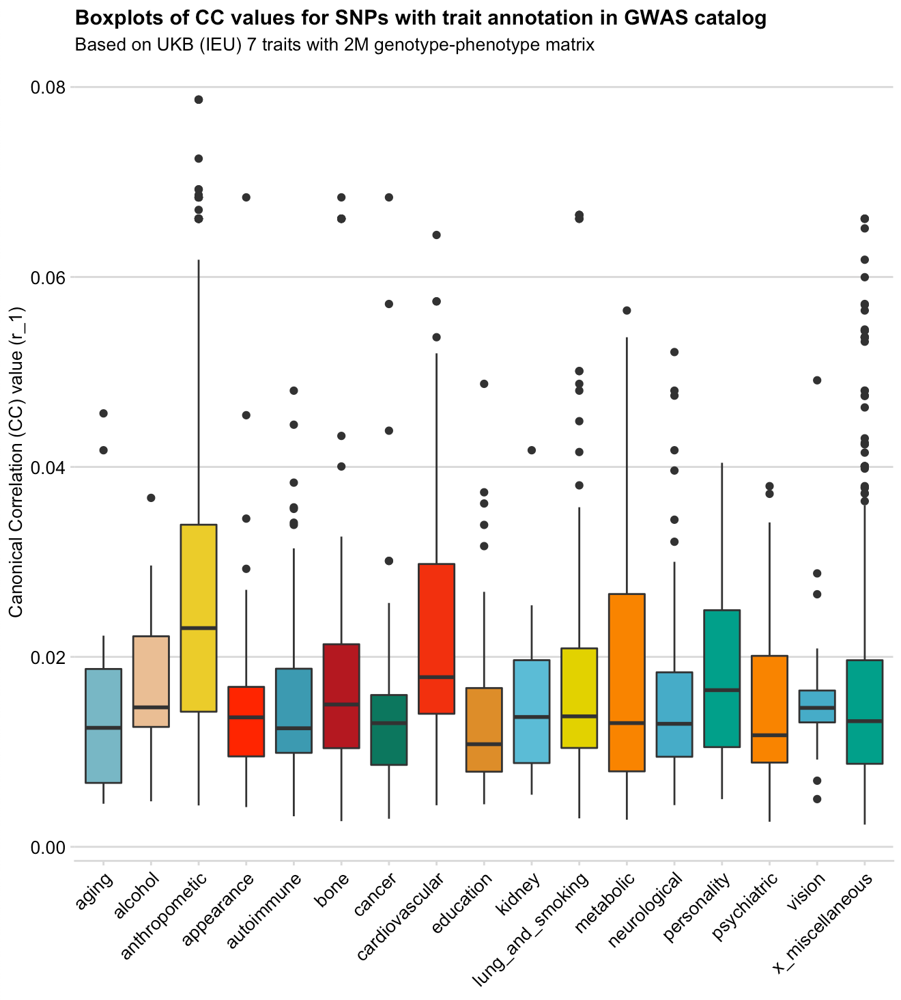
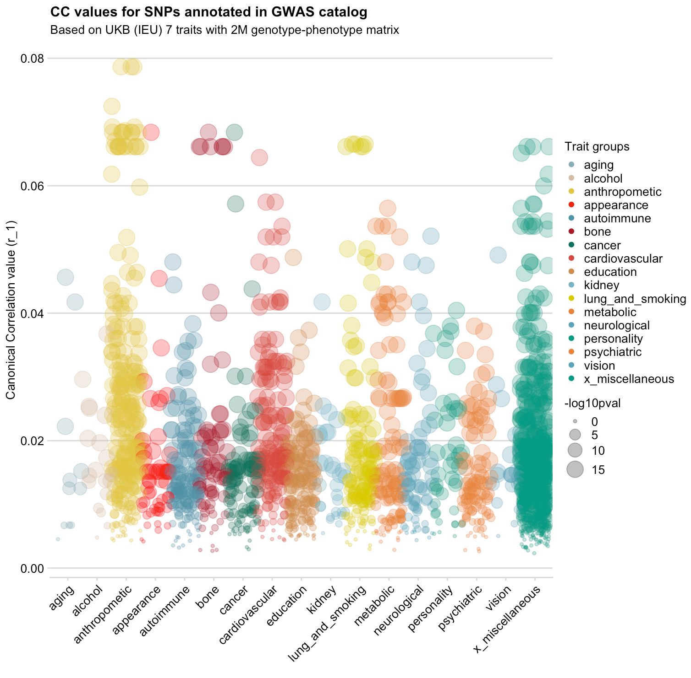

# Workflow for setting up metaCCA analysis fpr UKB traits measured in IEU and Neale Lab


Project folder location:`/projects/XXXremovedXXX/`.


## metaCCA brief introduction

**metaCCA** operates on three pieces of the full data covariance matrix:

- S_XX of genotype-genotype correlations
- S_XY of univariate genotype-phenotype association results
- S_YY of phenotype-phenotype correlations.

S\_XX is estimated from a reference database matching the study population, e.g. 
<br>
the 1000 Genomes.
S\_YY is estimated from S_XY.

[Paper](https://www.ncbi.nlm.nih.gov/pmc/articles/PMC4920109/)

[R package vingette](https://bioconductor.org/packages/release/bioc/vignettes/metaCCA/inst/doc/metaCCA.pdf)


## Repo structure

Parts of the analysis, to be used in this order:

```
0_standardise_nealelab_data.Rmd
1_prepare_data_XY.Rmd
2_prepare_data_XX_by_chr.Rmd
3_run_metaCCA_analysis.R
4_review_results_gwascat.Rmd
5_visualise.Rmd
```

## Results snapshot


<br>

<br>
 _Made with_ `5_visualise.Rmd`


## Selecting traits 

To select UKB-IEU traits I used the reference table `study-table-13-02-19_UKBonly.tsv `from UKB data (parsed with `biobank_traits_parser.R`).

UKB IEU traits (N=:
	
	* BMI: 19953 
	* Waist cirmunverence: 9405
	* Whole body fat mass: 19393
	* Whole body fat-free mass: 13354
	* Body fat percentage: 8909
	* Systolic blood pressure (automated): 20175
	* Diastolic blood pressure (automated): 7992

[Neale lab](http://www.nealelab.is/uk-biobank) UKB traits are described [here](https://www.ukbiobank.ac.uk/wp-content/uploads/2018/11/BCM023_ukb_biomarker_panel_website_v1.0-Aug-2015-edit-2018.pdf) and are available to download using the information in this [spreadsheet](https://docs.google.com/spreadsheets/d/1kvPoupSzsSFBNSztMzl04xMoSC3Kcx3CrjVf4yBmESU/edit?usp=sharing)


UKB Neale lab traits : (N=315,133)

	* 30760	HDL cholesterol (mmol/L)
	* 30780	LDL direct (mmol/L)
	* 30690	Cholesterol (mmol/L)
	* 30870	Triglycerides (mmol/L)
	* 30740	Glucose (mmol/L)

The data was downloaded with `wget` from the provided links in the spreadsheet. Then it was subset to only useful infomation:

```bash
cd data/S_XY_matrices/ukb/neale_lab/
gunzip -c 30690_raw.gwas.imputed_v3.both_sexes.tsv.bgz | cut -f1,2,8,9 > 30690_raw.gwas.tsv
gunzip -c 30740_raw.gwas.imputed_v3.both_sexes.tsv.bgz | cut -f1,2,8,9 > 30740_raw.gwas.tsv
gunzip -c 30760_raw.gwas.imputed_v3.both_sexes.tsv.bgz | cut -f1,2,8,9 > 30760_raw.gwas.tsv
gunzip -c 30780_raw.gwas.imputed_v3.both_sexes.tsv.bgz | cut -f1,2,8,9 > 30780_raw.gwas.tsv
gunzip -c 30870_raw.gwas.imputed_v3.both_sexes.tsv.bgz | cut -f1,2,8,9 > 30870_raw.gwas.tsv

gunzip -c variants.tsv.bgz | cut -f1-6 > variants_nealelab.tsv

```


## Creating genotype matrix (S_XX) from reference data


Firstly, overlap SNPs from the GWAS studies to be used with the reference data (1000 GP). Then prune data with r and annotate SNPs with gene names. The SNPs within genes will be used for LD matrix construction. 

* Reference 1000GP data is from [https://github.com/MRCIEU/gwasvcftools](https://github.com/MRCIEU/gwasvcftools): **1kg European reference panel for LD** [data\_maf0.01\_rs_ref.tgz](http://fileserve.mrcieu.ac.uk/ld/data_maf0.01_rs_ref.tgz): 9,003,401
* IEU UK biobank SNP list:  9,837,128
* Neale lab UK biobank SNP list: 13,791,468
* Gene annotation *glist-hg19* reference available here: [https://www.cog-genomics.org/plink/1.9/resources](https://www.cog-genomics.org/plink/1.9/resources) (~24K genes on autosomes)

Current location: project + `working/data/`


#### Create list of SNPs in UKB and GIANT, and overlap them

Get rsid\_REF\_ALT from GIANT dataset trait (ieu-a-2) and one UKB trait (should be enough)

```bash
less UKB-b-13354_subset.tsv | cut -f3,4,5 | sed 's/\t/_/g' | sort | uniq > testing_overlaps/ukb_common_snps.txt

cd snp_lists/
less variants_nealelab.tsv | cut -f6,4,5 | awk '{print $3"_"$1"_"$2}' | grep -v "rsid" | sort | uniq > ukb_nealelab_snps.txt

comm -12 ukb_common_snps.txt ukb_nealelab_snps.txt | sort | uniq | cut -f1 -d"_" > ukb_ieu_nealelab_common_snps_rsid.txt
	9,633,785	
```
`*_subset.tsv` were created and are stored here: BC4 `/mnt/storage/scratch/ny19205/metaCCA/ukb_traits/tmp`


#### Subset reference data to the GWAS list of SNPs

```bash
cd snp_lists/
# list of rsids to drop (various mismatched alle SNPs) 
# See `1_prepare_data_XY.Rmd` for details
cat sticky_snps.txt bad_allele_snps_IEUvsNL.txt > to_exclude_IEUandNL_analysis.txt
```


* subset only to position from IEU+NL UKB
* drop sticky SNPs (they create NaN in LD calculation)
* drop SNPs that have probelms with alleles
* restrict flipping of alleles
* keep only SNPs (not indels)


```bash
cd ../genotype_matrix_4/
$plink --bfile ../1000GPdata/data_maf0.01_rs_ref --extract ../snp_lists/ukb_ieu_nealelab_common_snps_rsid.txt --exclude ../snp_lists/to_exclude_IEUandNL_analysis.txt --out data_overlap --make-bed --keep-allele-order --snps-only
wc -l data_overlap.bim
	7,488,839
```


#### Pruning data
```bash
$plink --bfile data_overlap  --indep-pairwise 50 5 0.01 --out data_overlap
$plink --bfile data_overlap --extract data_overlap.prune.in --make-bed --out data_pruned  --keep-allele-order
wc -l data_pruned.bim
	135,993
```


#### Annotate SNPs with gene names
```bash
cat <(echo -e "CHR\\tSNP\\tBP\\tREF\\tALT") <(cut -f1,2,4,5,6 data_pruned.bim) > data_pruned_snps.txt
$plink --bfile --annotate data_pruned_snps.txt ranges=../snp_lists/glist-hg19 --out data_pruned
	58887 out of 135993 rows annotated
```

#### Subset data to the annotated genes 
```bash
# first select SNPs that got annotated with gene names
less data_pruned.annot| tr ' ' \\t |  grep -v "\." > annotated_genes.txt
	58829 # SNPs
	
# output SNP list
less annotated_genes.txt | grep -v "^CHR"| cut -f2 > annotated_SNPs_list.txt	
	
# count SNPs per gene
less annotated_genes.txt | cut -f6 | sort | uniq -c | sort -k1n > annotated_SNPs_per_gene.txt
	13431 # genes
```
13431 genes -- 58873 SNPs -- 1-229 SNPs per gene -- on average 4.38 SNPs per gene


#### Subset data to SNPs to include, and split into chromosomes

```bash
$plink --bfile data_overlap  --extract annotated_SNPs_list.txt  --out data_overlap_subset --keep-allele-order --make-bed
```

```bash
mkdir data_overlap_subset_by_chr
for chr in {1..22}; do
$plink --bfile data_overlap_subset --chr $chr --out data_overlap_subset_by_chr/data_overlap_chr${chr} --keep-allele-order --make-bed; 
done
 
# view SNPs by chr
wc -l data_overlap_subset_by_chr/*bim | sort -k1n
```


#### Create LD matrix from SNPs that belong to genes
Creates an *LD matrix of r values*  from 502 European samples from 1000 Genomes phase 3 data.

```bash 
mkdir ld_matrix_by_chr/
for chr in {1..22}; do 
$plink --bfile data_overlap_subset_by_chr/data_overlap_chr${chr} --r square --out ld_matrix_by_chr/ld_matrix_chr${chr} --keep-allele-order;
 done 
```

The 22 `ld_matrix_chrN.ld` files (6-262 MB) are the LD matrces that contain Pearson corrlation coefficients between the selected SNPs in the chromosome. Each matrix will be used as input to the metaCCA method as genotype-genotype matrix. 


#### Tidying up LD matrix

Add row and column names (SNPs) to each chr LD matrix in R, to make it suitable to be used as S_XX in metaCCA. 

See script: `1_prepapre_data_XX_per_chr.Rmd`

The output is `S_XX_matrices/LDmatrix_chrN.Rdata`  files that can be read in by the main metaCCA script.


## Creating genotype-phenotype matrix (S_XY) 

The data for selected IEU UKB studies is available in VCF format here: `/XremovedX` 

UKB IEU data was parsed using bash script `parse_gwas_vcf.sh`, which can be used on other datasets available in VCF. The script was run on BC4 in `/mnt/storage/scratch/ny19205/`, then clean tsvs were moved to project space to `data/S_XY_matrices/ukb` and `data/S_XY_matrices/ukb` .

The data from Neale Lab was downloaded from the spreadsheet mentioned in the first section. The data was pre-processed to in the forrmat as IEU UKB files using script `0_standardise_nealelab_data.Rmd`.

Then, IEU and Neale lab data was processed and merged using script `1_prepapre_data_XY.Rmd` which saves the data in `geno-pheno_matrix_UKB_NEALELAB.RData`.

## Running metaCCA

Both

- Univariate SNPs - multiple phenotypes analysis 
- Multivariate SNPs - multiple phenotypes analysis 

are scripted in `3_run_metaCCA_analysis.R` to be run in parallel process on BC3.

Submission script`: `submit_metaCCA_jobs.sh` 

Submit one chr job to one node (16 cores):

```qsub -l walltime=05:00:00 submit_metaCCA_jobs.sh -F "22"```

## Post-metaCCA results processing

### Multivariate SNPs (gene-based analysis)

The output is 22 files `metaCCA_multisnp_genes_chrN.tsv`

Merge then and tidy up like this:

```bash
cat metaCCA_multisnp_genes_chr* | gsed  -z 's/,\n/,/g' | gsed  -z 's/\n"/"/g'  |  sort -k2 -r | uniq > multivar_metaCCA_merged_results.tsv
``` 

Not much intresting after that at the moment.

### Univariate SNPs (SNPs-based analysis)

`4_review_results_gwascat.Rmd` - merge results with GWAS catalog and annotate by groups

`5_visualise.Rmd` - boxplots, dotplots, barplots
