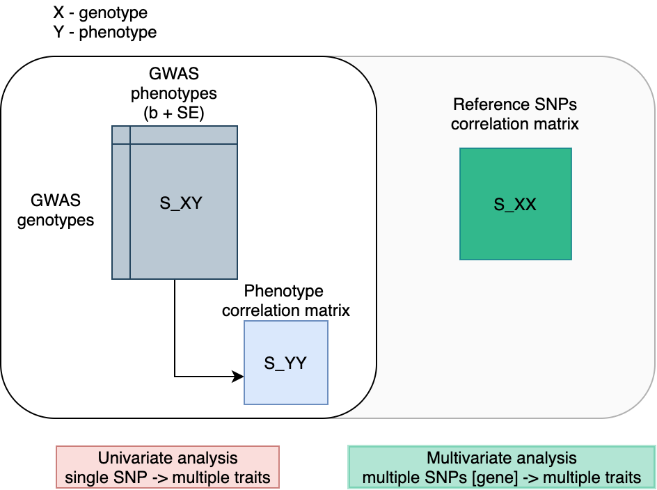
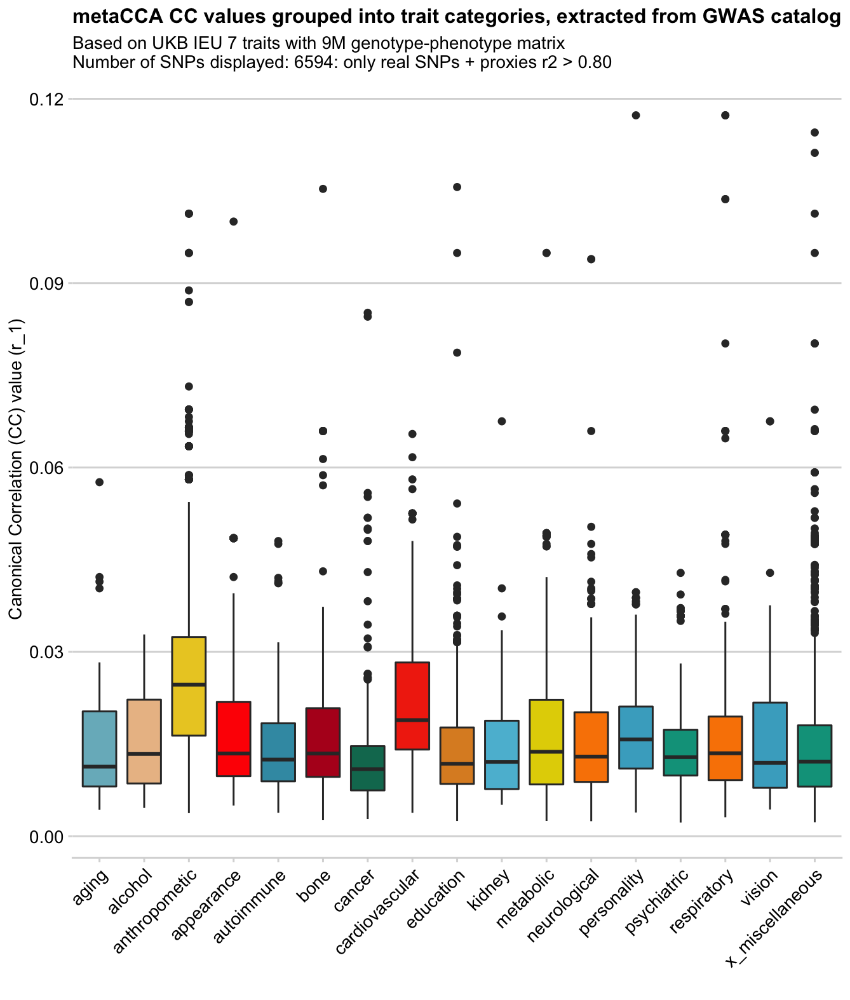
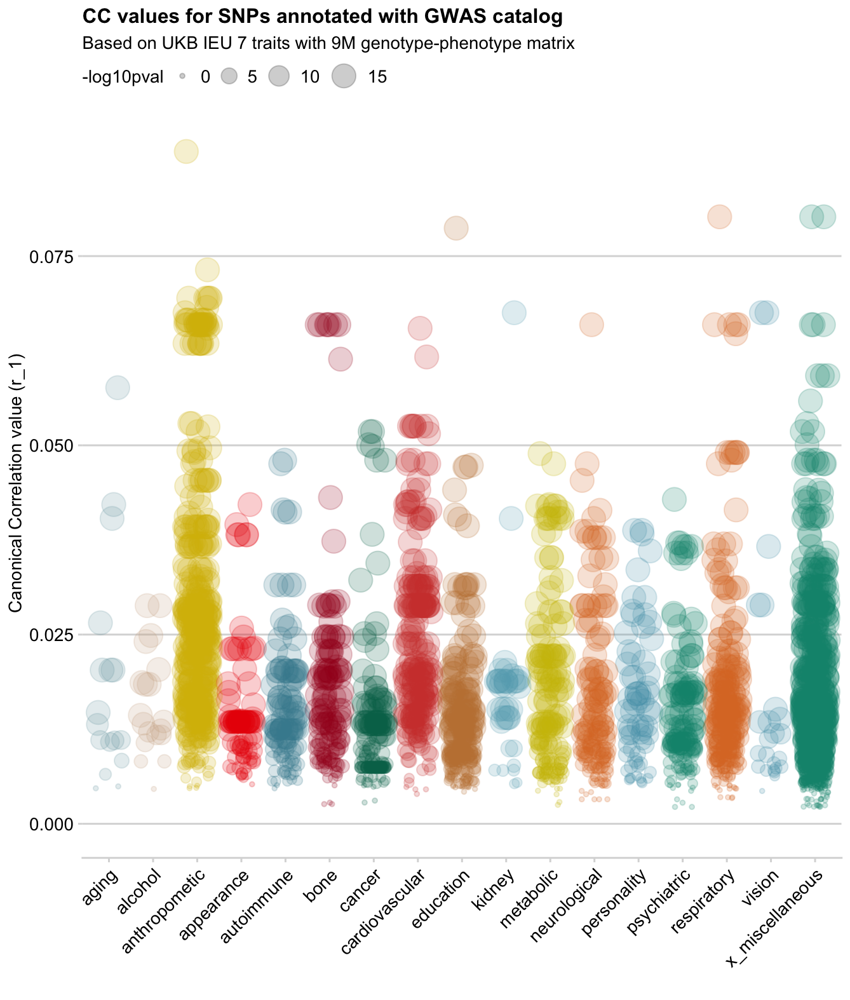

# Applying metaCCA to IEU-GWAS database


Project folder on epi-franklin:`/projects/XremovedX/`.


## Project background

A dominant approach to genetic association studies is to perform univariate tests between genotype-phenotype pairs, where each SNP is examined independently for association with the given phenotype.

However, if we could analyse the results of multiple GWAS studies together in a joint-analysis, this would not only provide increased statistical power, but also may reveal certain complex associations that are only detectable when several variants or traits are tested jointly. 

In [IEU-GWAS db](https://gwas.mrcieu.ac.uk/) there is a lot of data (28K traits) that can be investigated in that way, with many traits that could have novel associations and correlations. We’re particularly interested in finding genetic correlations between phenotypes that may be collectively contributing to a groups of diseases.
In other words, we are interested in finding genes with pleiotropic effects. Those genes are not well-defined but are abundant, as findings of many GWAS studies overlap. Pleiotropy term is used to describe a scenario when the same locus (SNP/gene) affects multiple traits, via two main mechanisms:

* _horizontal pleiotropy_: may lead to a better understanding of biological processes that are common between traits
* _vertical pleiotropy_: can inform on causality for intervention strategies for disease prevention.


## metaCCA 
[Paper](https://www.ncbi.nlm.nih.gov/pmc/articles/PMC4920109/), [R package vingette](https://bioconductor.org/packages/release/bioc/vignettes/metaCCA/inst/doc/metaCCA.pdf)

#### Brief introduction
MetaCCA can be used to systematically identify potential pleiotropic genes using GWAS summary statistics by combining correlation signals among multiple traits.

* metaCCA uses GWAS summary statistics (𝛽 and std.err)
* Can combine single or multiple studies in one analysis
* Can use multivariable representation of both genotype and phenotype
* Based on CCA (canonical correlation analysis)
* Result is the maximized correlation coefficient R1 


_metaCCA provides two types of the multivariate association analysis:_

* **Single-SNP–multi-trait analysis**: 1 SNP → N traits

 One genetic variant tested for an association with a set of phenotypic variables 
 
* **Multi-SNP–multi-trait analysis**: N SNPs [genes] → N traits

	A set of genetic variants tested for an association with a set of phenotypic variables.
<br><br>

#### The method

**metaCCA** operates on three pieces of the full data covariance matrix:

- S_XX of genotype-genotype correlations
- S_XY of univariate genotype-phenotype association results
- S_YY of phenotype-phenotype correlations.

S\_XX is estimated from a reference database matching the study population, e.g. the 1000 Genomes.
S\_YY is estimated from S_XY.





## Workflow

The analysis cointains several stages:

1. Traits/data selection
2. Input data processing/cleaning (both GWAS and reference)
3. Input matrix generation (S_XY)
4. Reference matrix generation (S_XX) **NB there may be some overlap/depencence between 3 and 4*
4. Run metaCCA script (submit on BC3)
5. Output processing
7. Output annotation with GWAS catalog 
6. Visualisation

## Case studies

While exploting metaCCA, I have done several case studies to investigate various properties of metaCCA. Each case study is described in a separate README. 

1. UK Biobank only (easiest working case) [here](docs/analysis_ukb.md)
2. UK Biobank + GIANT [here](docs/analysis_ukb_giant.md)
3. UK Biobank (IEU) + UK Biobank (Neale Lab)[here](docs/analysis_ukb_ieu_nl.md)

## Scripts in this repo

### Workflow-related

```
── main_workflow
│   ├── select_traits/biobank_traits_parser.Rmd
│   ├── parse_gwas_vcf.sh *OR*
│   ├── parse_gwas_vcf_snakemake/ 
│   ├── 0_standardise_nealelab_data.Rmd
│   ├── 1_prepare_data_XX_by_chr.Rmd
│   ├── 2_prepare_data_XY.Rmd
│   ├── 3_run_metaCCA_analysis.R
│   ├── 3_runmetaCCA_testing_manually.Rmd
│   ├── 4_review_results_gwascat.Rmd
│   ├── 5_visualise.Rmd
│   ├── python_LDproxies

```

### Exploratory scripts

```
├── exploratory_analysis
│   ├── compare_effect_size.Rmd
│   ├── compare_r_and_r2_results.Rmd
│   ├── compare_results_UKBvsUKBGIANT.Rmd
│   └── manhattan_plot.Rmd
```


## Data folders

.. are outside this repo, but the structure is as follows:

```
├── 1000GPdata			# raw reference data
├── annotation			# gene annotation files
├── genotype_matrix_1	# interemetiate files from case study 1
├── genotype_matrix_2	# interemetiate files from case study 2
├── genotype_matrix_3	# interemetiate files from case study 3
├── gwas_catalog		# GWAS catalog raw and subset and annotation files
├── README.txt
├── results				# weekly file storage
├── snp_lists			# intermediate and common-to-all files
├── S_XX_matrices		# per chr LD matrices for each case study
└── S_XY_matrices		# XY matrices for each case study + standardised tsv (from rawVCF)
```


## External data

* Reference 1000GP data is from [https://github.com/MRCIEU/gwasvcftools](https://github.com/MRCIEU/gwasvcftools):

 **1kg European reference panel for LD** [data\_maf0.01\_rs_ref.tgz](http://fileserve.mrcieu.ac.uk/ld/data_maf0.01_rs_ref.tgz): 9,003,401
 
 Located here: `data/1000GPdata/data_maf0.01_rs_ref`

* Gene annotation *glist-hg19* reference available here: [https://www.cog-genomics.org/plink/1.9/resources](https://www.cog-genomics.org/plink/1.9/resources) (~24K genes on autosomes)

* GWAS catalog download is from here: [https://www.ebi.ac.uk/gwas/docs/file-downloads](https://www.ebi.ac.uk/gwas/docs/file-downloads) (v1.0.2)


## Data viz

Showing some examples of plots I've made over the course of the project

### GWAS catalog annotation plots

<br>


### UKB VS GIANT explorations

<br>

<br>

<br>

<br>

<br>
