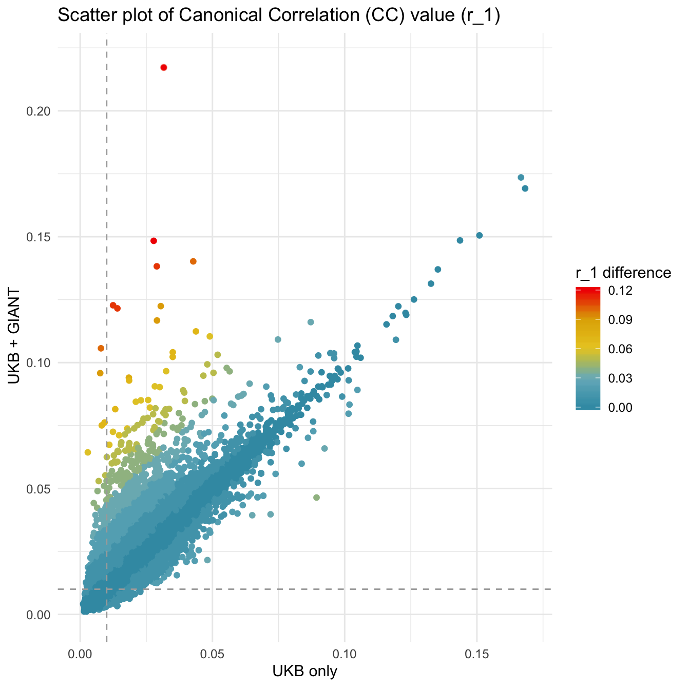
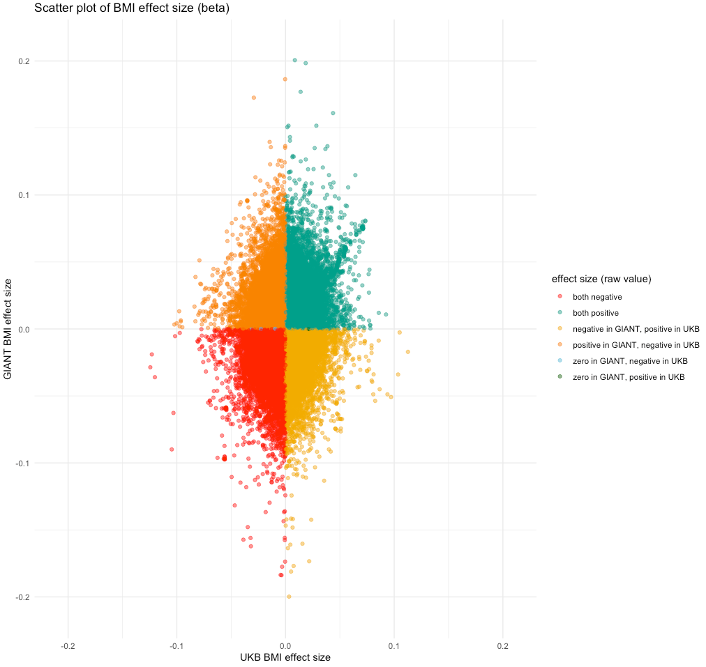

# Case study 2: UKB+GIANT, setting up metaCCA analysis

Current location: project + `working/data/`

Plink (on epi-franklin): `$plink = /data/ny19205/software/plink/plink`

## Selecting traits (IEU-GWAS db)


UKB traits:
	
	* BMI: 19953 
	* Waist cirmunverence: 9405
	* Whole body fat mass: 19393
	* Whole body fat-free mass: 13354
	* Body fat percentage: 8909
	* Systolic blood pressure (automated): 20175
	* Diastolic blood pressure (automated): 7992

GIANT trait:

	* BMI: 2

* UK biobank SNP list (the same for all traits):  9,837,128
* GIANT SNP list: 2,554,338

## Preparing the input data

The data for selected studies is available in VCF format here: `/mnt/storage/private/mrcieu/research/scratch/IGD/data/public/` (BC4)

UKB and GIANT data was parsed using bash script `parse_gwas_vcf.sh`, which can be used on other datasets available in VCF. The script was run on BC4 in `/mnt/storage/scratch/ny19205/`, then clean tsvs were moved to project space to `data/S_XY_matrices/ukb` and `data/S_XY_matrices/ukb` .


#### Reference data

1.  Create list of SNPs in UKB and GIANT, and overlap them

	Get rsid\_REF\_ALT from GIANT dataset trait (ieu-a-2) and one UKB trait (should be enough)
	
	```bash
	less ieu-a-2_subset.tsv | cut -f3,4,5 | sed 's/\t/_/g' | sort | uniq > testing_overlaps/giant_common_snps.txt
	less UKB-b-13354_subset.tsv | cut -f3,4,5 | sed 's/\t/_/g' | sort | uniq > testing_overlaps/ukb_common_snps.txt
	comm -12 ukb_common_snps.txt giant_common_snps.txt | sort | uniq | cut -f1 -d"_" > ukb_giant_common_snps_rsid.txt
		2,220,490	
	```
	`*_subset.tsv` were created and are stored here: BC4 `/mnt/storage/scratch/ny19205/metaCCA/ukb_traits/tmp`


2. Subset reference data to the GWAS list of SNPs
	
	```bash
	cd ../genotype_matrix_3/
	$plink --bfile ../1000GPdata/data_maf0.01_rs_ref --extract ../snp_lists/ukb_giant_common_snps_rsid.txt --exclude ../snp_lists/to_exclude_giant_analysis.txt --out data_overlap --make-bed --keep-allele-order --snps-only
	wc -l data_overlap.bim
		2,170,498
	```
	what this does:

	* subset only to position from UKB+GIANT
	* drop sticky SNPs (they create NaN in LD calculation)
	* drop SNPs that have probelms with alleles
	* restrict flipping of alleles
	* keep only SNPs (not indels)

	SNPs to exclude list was made by this:

	```bash
	cd snp_lists/
	# list of rsids to drop (various mismatched alle SNPs)
	cat sticky_snps.txt bad_allele_snps_giant.txt > to_exclude_giant_analysis.txt
	```
	

## Creating genotype-phenotype matrices (S_XY) for studies

For this comparison we want to ceate two S_XY matrices: 

1. contains 7 UKB measured traits, including `19953` as BMI

2. contains 6 UKB measured traits, where as BMI trait is from GIANT cohort `2`


Then, to join the within-study trait data used script `1_prepapre_data_XY.Rmd` which saves the data in `geno-pheno_matrix_UKB_2M.RData` and `geno-pheno_matrix_UKB_GIANT_2M.RData`.


## Creating genotype matrix (S_XX) from reference data


#### Pruning data
```bash
$plink --bfile data_overlap  --indep-pairwise 50 5 0.1 --out data_overlap
$plink --bfile data_overlap --extract data_overlap.prune.in --make-bed --out data_pruned  --keep-allele-order
wc -l data_pruned.bim
	110,921
```

#### Annotate SNPs with gene names
```bash
cat <(echo -e "CHR\\tSNP\\tBP\\tREF\\tALT") <(cut -f1,2,4,5,6 data_pruned.bim) > data_pruned_snps.txt
$plink --bfile --annotate data_pruned_snps.txt ranges=../snp_lists/glist-hg19 --out data_pruned
	49087 out of 110921 rows annotated
```

#### Subset data to the annotated genes 
```bash
# first select SNPs that got annotated with gene names
less data_pruned.annot| tr ' ' \\t |  grep -v "\." > annotated_genes.txt
	49027 # SNPs
	
# output SNP list
less annotated_genes.txt | grep -v "^CHR"| cut -f2 > annotated_SNPs_list.txt	
	
# count SNPs per gene
less annotated_genes.txt | cut -f6 | sort | uniq -c | sort -k1n > annotated_SNPs_per_gene.txt
	11317 # genes
```
11317 genes -- 49028 SNPs -- 1-336 SNPs per gene -- on average 4.33 SNPs per gene

#### Subset data to SNPs to include, and split into chromosomes

```bash
$plink --bfile data_overlap  --extract annotated_SNPs_list.txt  --out data_overlap_subset --keep-allele-order --make-bed
```

```bash
mkdir data_overlap_subset_by_chr
for chr in {1..22}; do
$plink --bfile data_overlap_subset --chr $chr --out data_overlap_subset_by_chr/data_overlap_chr${chr} --keep-allele-order --make-bed; 
done
 
# view SNPs by chr
wc -l data_overlap_subset_by_chr/*bim | sort -k1n
```


#### Create LD matrix from SNPs that belong to genes
Creates an *LD matrix of r values*  from 502 European samples from 1000 Genomes phase 3 data.

```bash 
mkdir ld_matrix_by_chr/
for chr in {1..22}; do 
$plink --bfile data_overlap_subset_by_chr/data_overlap_chr${chr} --r square --out ld_matrix_by_chr/ld_matrix_chr${chr} --keep-allele-order;
 done 
```

The 22 `ld_matrix_chrN.ld` files (10-379 MB) are the LD matrces that contain squared Pearson corrlation coefficients between the selected SNPs in the chromosome. Each matrix will be used as input to the metaCCA method as genotype-genotype matrix. 


#### Tidying up LD matrix

Add row and column names (SNPs) to each chr LD matrix in R, to make it suitable to be used as S_XX in metaCCA. 

See script: `1_prepapre_data_XX_per_chr.Rmd`

The output is `S_XX_matrices/LDmatrix_chrN.Rdata`  files that can be read in by the main metaCCA script.


## Running metaCCA

Currently simple testing is done in `2_analyse_data_testing.Rmd `. 

Both

- Univariate SNPs - multiple phenotypes analysis 
- Multivariate SNPs - multiple phenotypes analysis 

are scripted in `3_run_metaCCA_analysis.R` to be run in parallel process on BC3.

Submission script on BC3 (or here) in `/newhome/ny19205/metaCCA_big_jobs`: `submit_metaCCA_jobs.sh` 

Submit one chr job to one node (16 cores):

```qsub -l walltime=05:00:00 submit_metaCCA_jobs.sh -F "22"```

## Post-metaCCA results processing

### Multivariate SNPs (gene-based analysis)

The output is 22 files `metaCCA_multisnp_genes_chrN.tsv`

Merge then and tidy up like this:

```bash
cat metaCCA_multisnp_genes_chr* | gsed  -z 's/,\n/,/g' | gsed  -z 's/\n"/"/g'  |  sort -k2 -r | uniq > multivar_metaCCA_merged_results.tsv
``` 

Not much intresting after that at the moment.

### Univariate SNPs (SNPs-based analysis)

`4_review_results_gwascat.Rmd` - merge results with GWAS catalog and annotate by groups

In the middle of this R script can get LD proxies using Python script `python_LDproxies/get_LD_proxies.py` to match more things in GWAS catalog

`5_visualise.Rmd` - boxplots, dotplots, barplots


## Exploratory analysis between two metaCCA

Firstly, going to compare `r_1` output:

1. contains 7 UKB measured traits, including `19953` as BMI

2. contains 6 UKB measured traits, where as BMI trait is from GIANT cohort `2`

### Explore data and plot the `r_1` difference

Script: `exploratory_analysis/compare_results_UKBvsUKBGIANT.Rmd`



### Explore effect size of BMI between UKB and GIANT:



### Explore relationship between effect size and r_1 of SNPs that disagree most:


